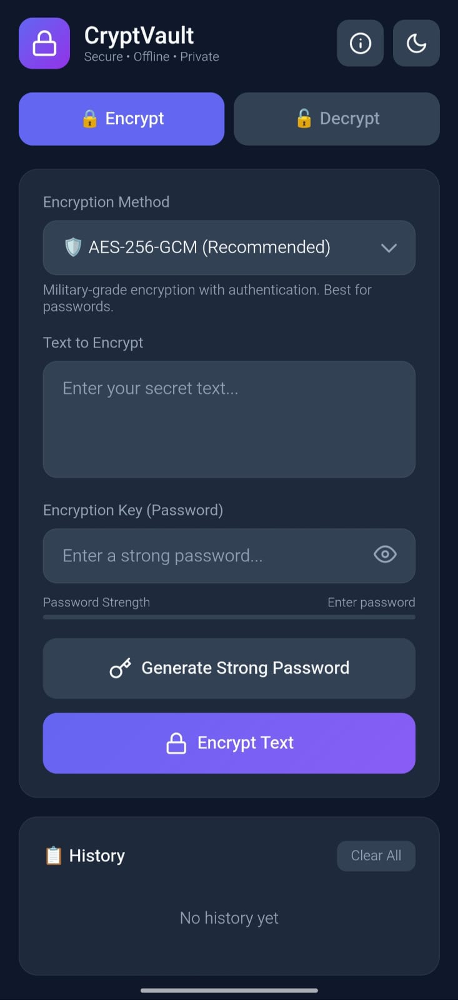
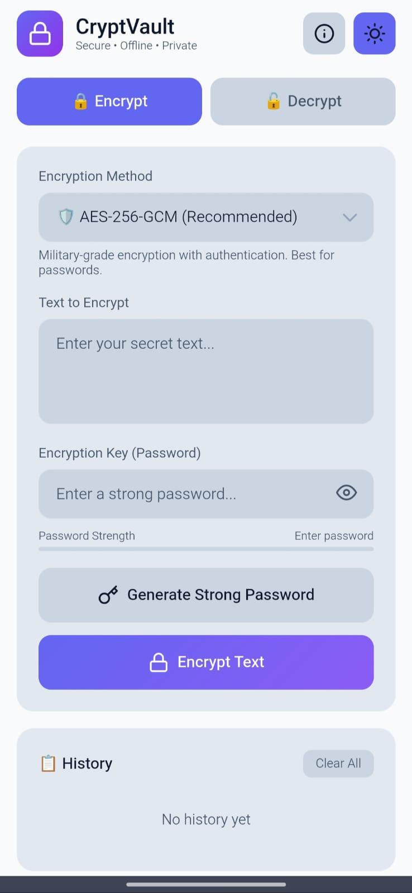

# 🔐 CryptVault

Secure, offline-first text encryption app. Military-grade encryption that works 100% on your device.

## ✨ Features

- 🔒 **5 Encryption Methods** - AES-GCM, AES-CBC, AES-CTR, Triple Layer, Simple
- 📴 **100% Offline** - No internet needed
- 🔐 **Zero Data Collection** - Everything stays on device
- 📋 **History** - Quick access to recent encryptions
- 🌙 **Dark/Light Mode**
- 🔑 **Password Generator**

## 📥 Download

### Android
[](https://github.com/potatameister/CryptVault/releases/latest)

### Web
🌐 [Open in Browser](https://potatameister.github.io/CryptVault/)

## 📸 Screenshots

<p align="center">
  
  
</p>

## 🛡️ Security

- **AES-256** encryption
- **PBKDF2** key derivation (100,000 iterations)
- Random salt & IV for each encryption
- No data leaves your device
- Open source - audit it yourself!

## 🔒 Encryption Methods

| Method | Description |
|--------|-------------|
| AES-GCM | Recommended. Military-grade with authentication |
| AES-CBC | Classic bank-level encryption |
| AES-CTR | Fastest for large texts |
| Triple Layer | Maximum security |
| Simple | Same input = same output (deterministic) |

## 📄 License

[MIT License](LICENSE) - Free to use, modify, distribute.

## 🤝 Support the Development

CryptVault is built to be 100% free, offline, and open-source. There are no ads, no trackers, and no servers.

If you value privacy tools and want to support my "vibecoding" sessions (or just buy me a coffee), you can support the project here:

[](https://github.com/sponsors/potatameister)

### 🕵️ Private Donations (Crypto)

Prefer to stay anonymous? I accept crypto donations.

<details>
<summary><strong>Click to show Wallet Addresses</strong></summary>

<br>

**Monero (XMR) - The Privacy Choice**
```text
85rGKZsK4W7ENiP2xmTwDPG11W9uswJob4xgcQeby13wUFyRrWAhFzHN6nLSmQi1kV58tzUhswYqR5E1txL2HnCg6fP5gn6
```

**Bitcoin (BTC)**
```text
bc1qpamdenvjmzmjumz24s3hymcn77xu8gy9ur04ll
```

</details>

## 👨‍💻 Author

Made with ❤️ by [@potatameister](https://github.com/potatameister)

---

⭐ Star this repo if you find it useful!
